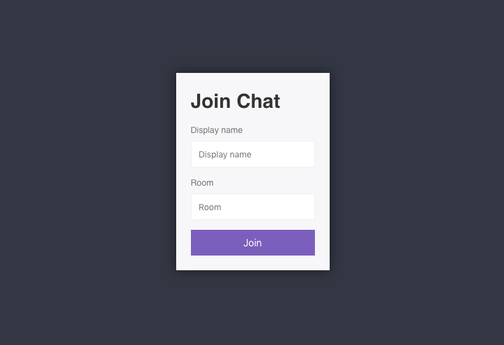
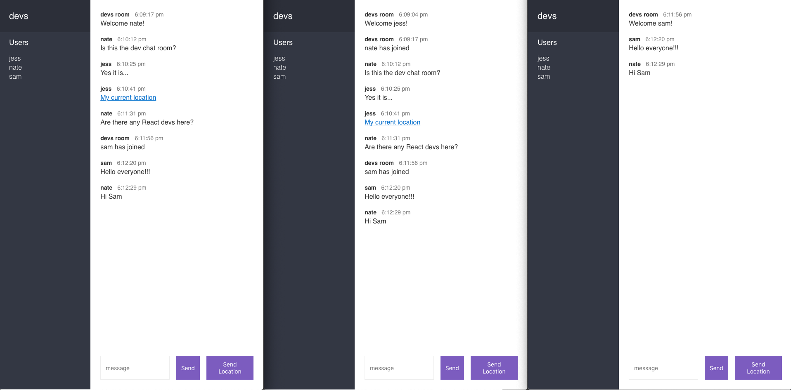

# Chat App

Real-time chat application using Express and Socket.io.  Uses simply provide and name and the room they want to join.  All users in the same room can chat in real-time and send a Google Maps link to their current location.

### View [working demo](https://chat-app-nds.herokuapp.com/)

> PLEASE NOTE: This app is hosted on a Heroku free tier.  If currently in 'sleep mode' (from lack of recent activity) the initial request time may be up to 10 seconds.  Subsequent requests will perform normally.  This is not a performance/optimization issue with the app itself.

Have multiple instances open and type in the same room name.

 

 

